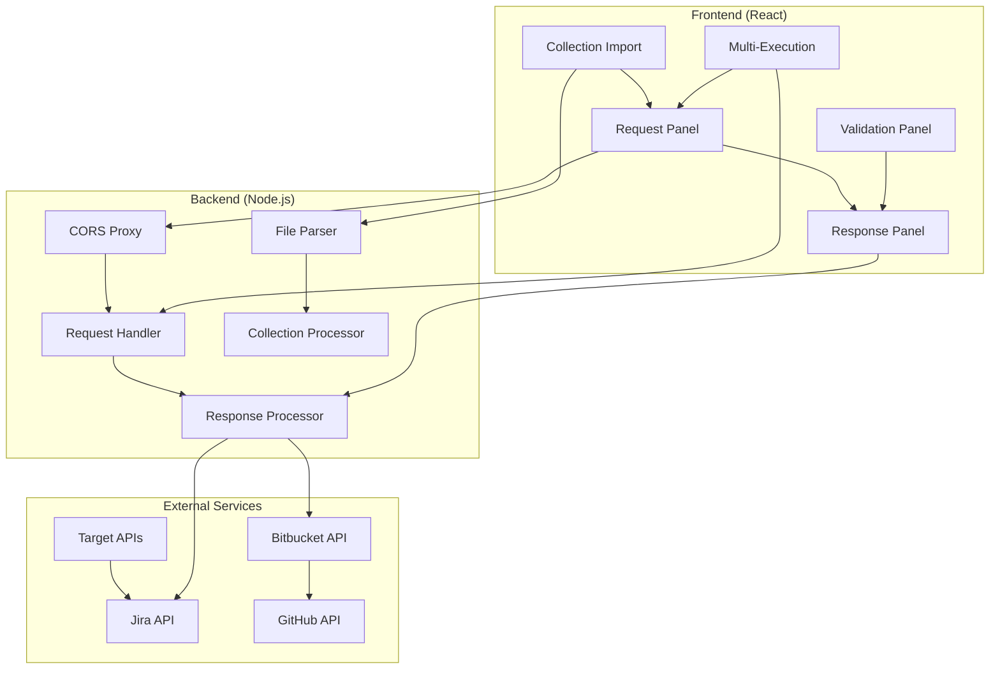
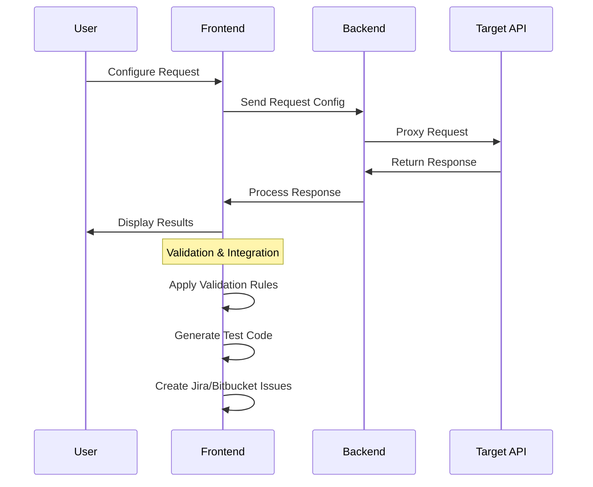
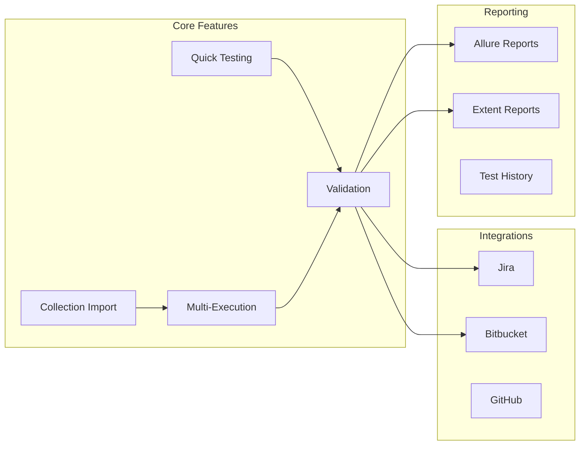
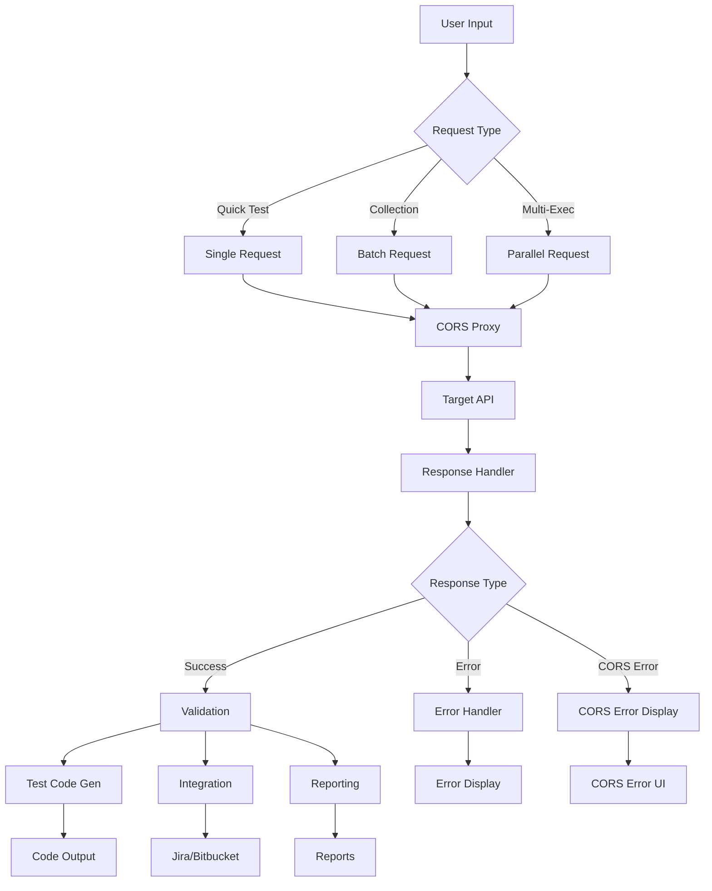
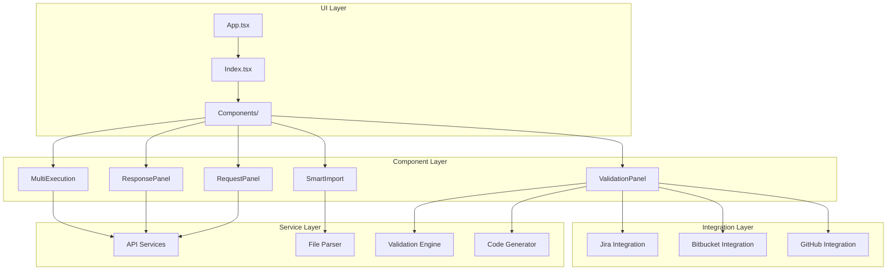
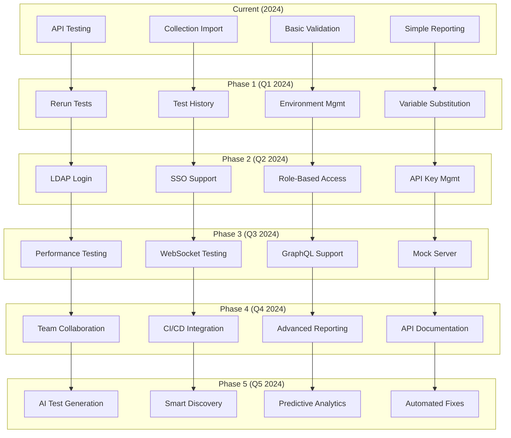
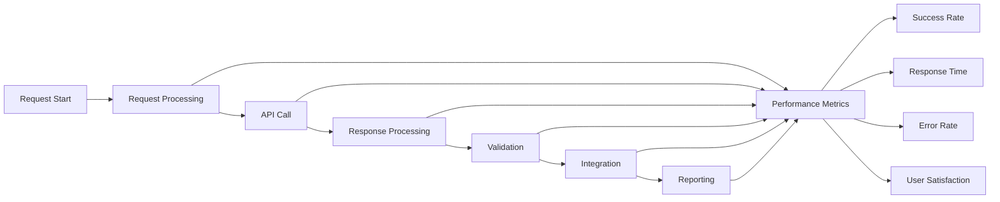
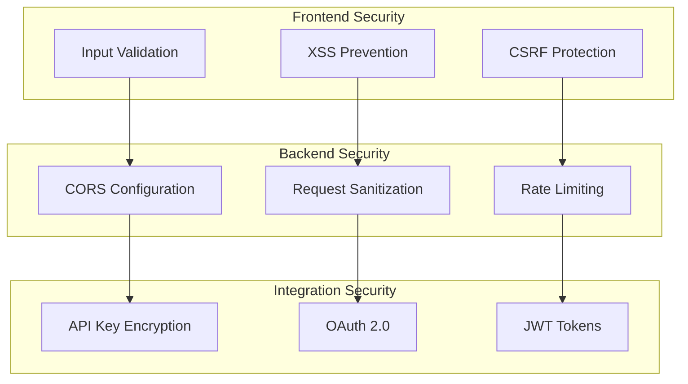
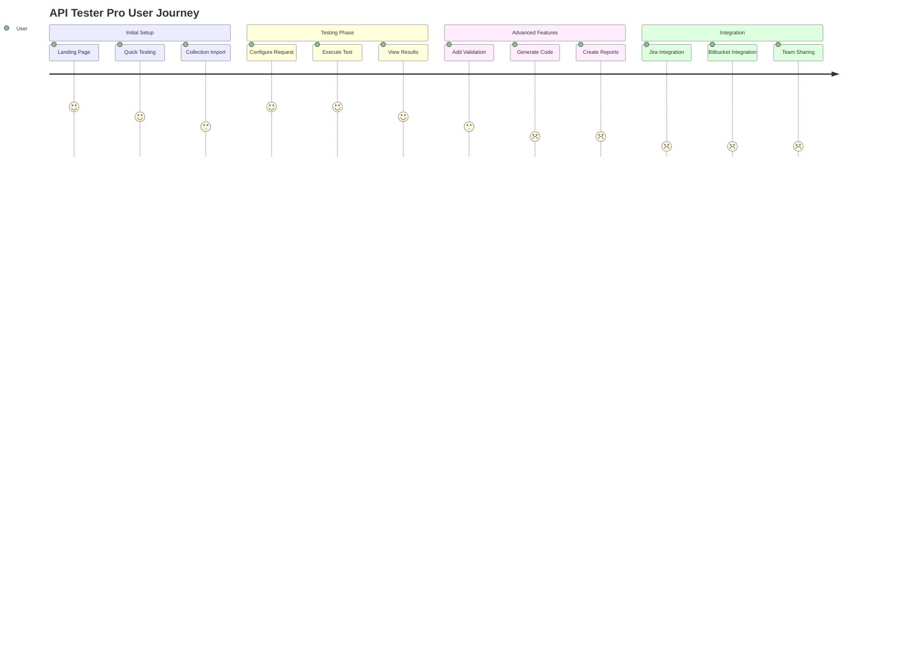

# API Tester Pro - Architecture Diagrams

## 🏗️ System Architecture Overview

## 🔄 Request Flow Diagram

## 📊 Feature Interaction Matrix

## 🎯 Data Flow Architecture

## 🔧 Component Architecture

## 🚀 Future Architecture (Roadmap)

## 📈 Performance Metrics Flow

## 🔐 Security Architecture

## 🎯 User Journey Flow

---

*These diagrams provide a comprehensive view of the API Tester Pro architecture, current features, and future roadmap.* 